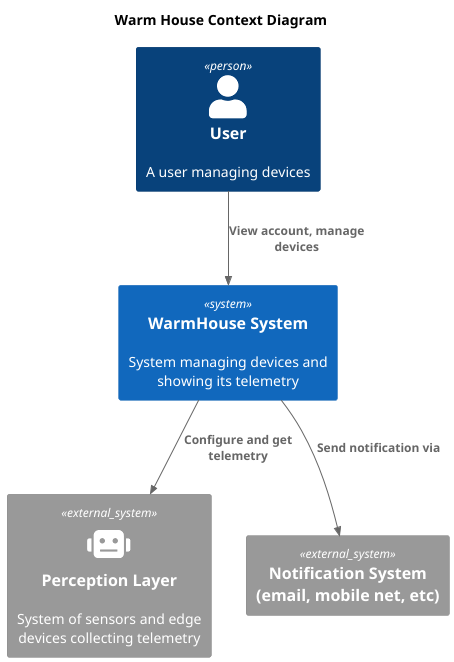
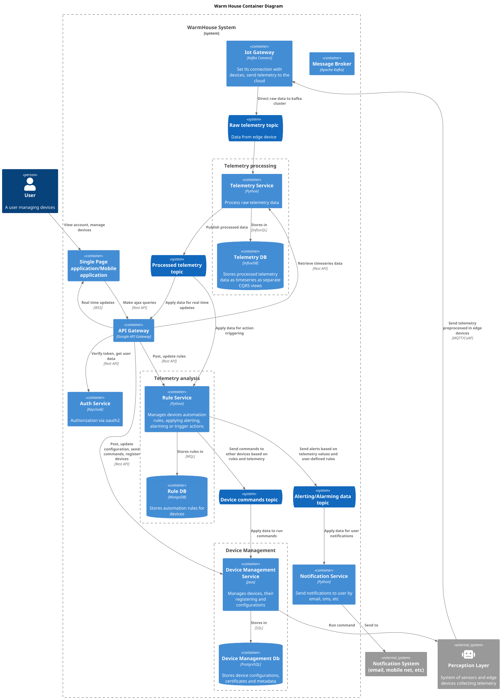
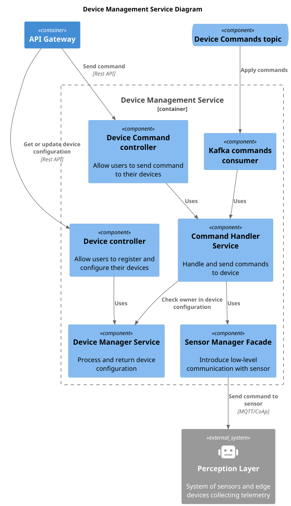
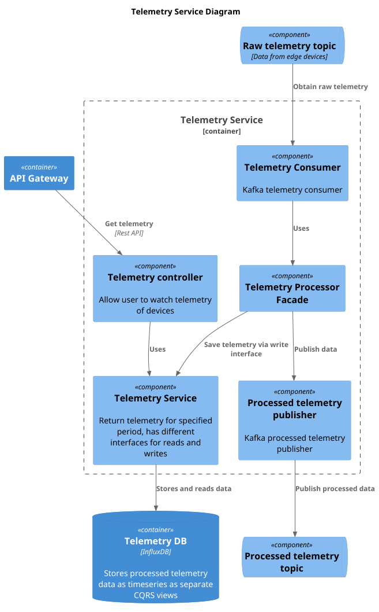
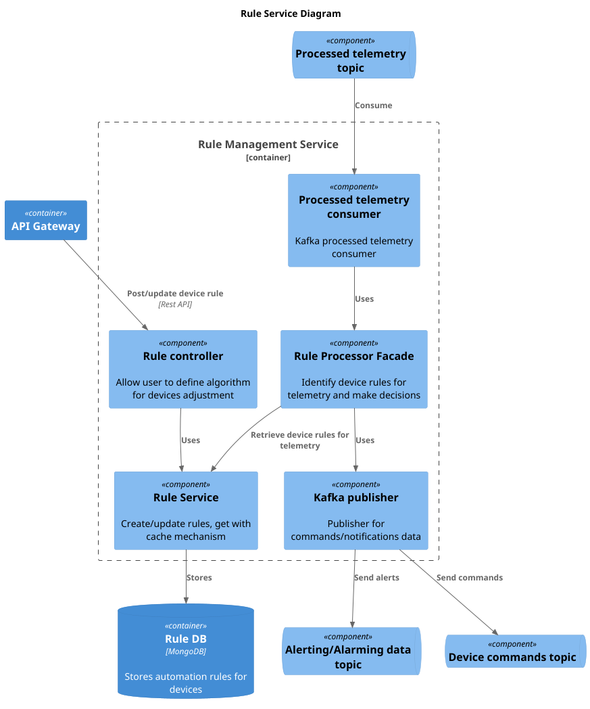
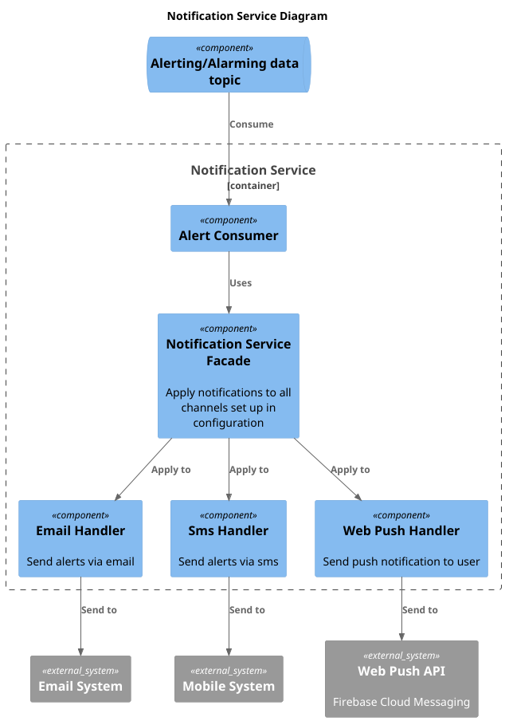
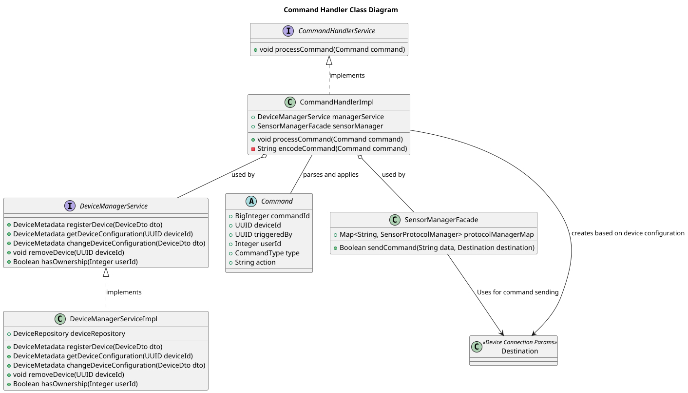
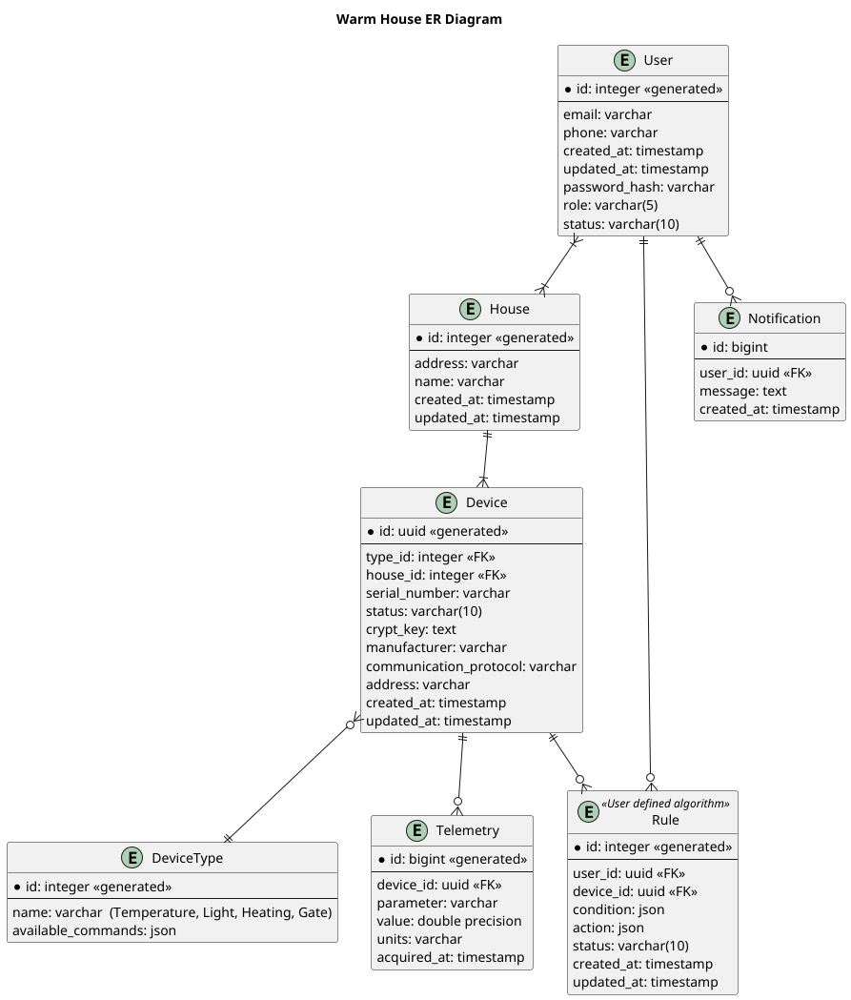

# Задание 1. Анализ и планирование

### 1. Описание функциональности монолитного приложения

**Управление отоплением:**

- Пользователи могут следить за текущей температурой системы отопления, а также конфигурировать ее (включать/выключать, менять целевую температуру) через веб интерфейс   
Пользователи могут вызвать мастера для установки и настройки новых датчиков
- Система поддерживает задание конфигурации и отслеживание значений датчиков посредством синхронных вызовов к датчику с сервера приложения. Настройка отслеживания требует предварительного вмешательства технических специалистов

**Мониторинг температуры:**

- Пользователи могут следить за текущей температурой датчика и генерировать графики изменения значений через веб-интерфейс
- Система поддерживает задание конфигурации и отслеживание значений датчиков посредством синхронных вызовов к датчику с сервера приложения. Настройка отслеживания требует предварительного вмешательства технических специалистов. Также система хранит временной ряд значений для ретроспективы

### 2. Анализ архитектуры монолитного приложения
- **Язык программирования**: Java
- **База данных**: PostgreSQL
- **Архитектура**: Монолитная, все компоненты системы (обработка запросов, бизнес-логика, работа с данными) находятся в рамках одного приложения.
- **Взаимодействие**: Синхронное, запросы обрабатываются последовательно, идут от сервера к датчику
- **Масштабируемость**: Ограничена, так как монолит сложно масштабировать по частям.
- **Развёртывание**: Требует остановки всего приложения, не настроен пайплайн CI/CD
- **Тип приложения**: Stateless

### 3. Определение доменов и границы контекстов

1. Управление пользователями (функции, связанные с обработкой и управлением пользовательскими данными, доступом, мониторинг трафика)
   - контекст: авторизация и регистрация
   - профиль пользователя
   - управление подпиской
   
2. Управление устройствами (функции, связанные с обработкой и управлением конфигурацией и метаданными устройств, настройка устройств)
   - регистрация устройств
   - выдача ключей шифрования
   - управление конфигурацией (в т.ч. отправка команд)

3. Сбор телеметрии (функции, связанные со сбором и интеграцией данных внутри системы)
   - предобработка данных в edge модулях
   - интеграция и хранение временных рядов телеметрии

4. Анализ телеметрии (постпроцессинг интегрированных данных, выполнение действий на основе значений телеметрии)
   - алертинг и аларминг
   - выполнение правил, заданных пользователем

### **4. Проблемы монолитного решения**
Так как требования и функциональность приложения расширяются, необходимость в быстрой доставке возрастает, то текущее решение создает проблемы:
- Трудности с масштабированием (ex. Сбор данных может быть в значительной степени более нагружен, чем конфигурация устройств. Масштабирование всего монолита потребует выделения больших ресурсов)
- Длительный цикл разработки и развертывания (у системы отсутствует CI/CD -> 
долгий путь от разработки до развертывания, риск ошибок деплоя; длительный этап регрессионного тестирования)
- Снижение надежности приложения - одна изолированная часть бизнес-процесса может повлиять на другие, а использование общих ресурсов снижает отказоустойчивость и высокую доступность
- Зависимость от постоянно устаревающего стэка технологий в условиях бизнеса, требующих применения новейших разработок

Кроме того вследствие применения исключительно синхронных взаимодействий при расширении системы могут возникнуть проблемы
- полное блокирование центрального сервера или существенное снижение его производительности
- нерелевантность даннных в центральном хранилище
- потеря данных вследствие превышения количества максимально доступных соединений или медленного сбора
- ограничения параллельных вычислений
- снижение производительности как следствие затрат на установку соединений

### 5. Визуализация контекста системы — диаграмма С4

# Задание 2. Проектирование микросервисной архитектуры

**Диаграмма контейнеров (Containers)**

**Диаграмма компонентов (Components)**

**Диаграмма кода (Code)**

# Задание 3. Разработка ER-диаграммы

